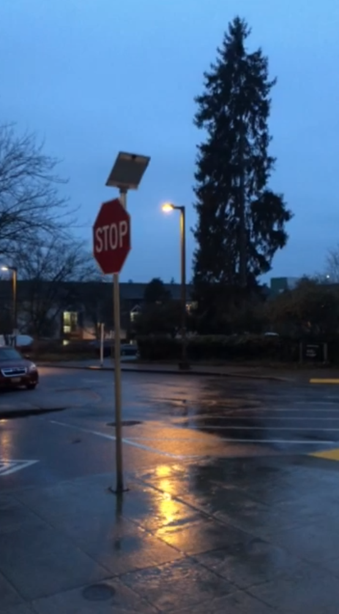
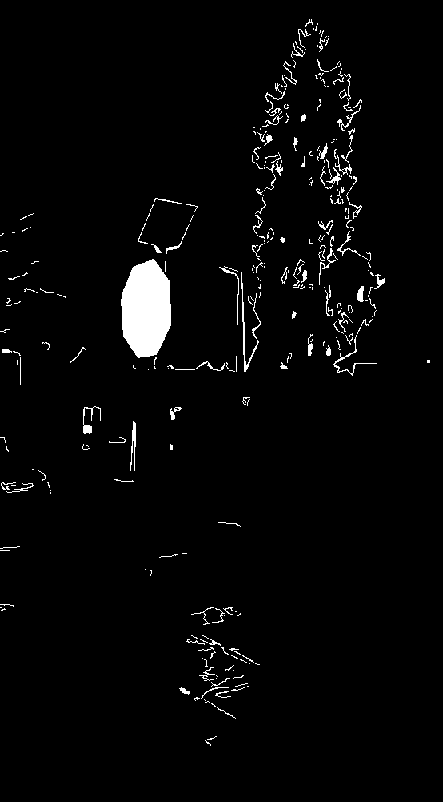

# Stop Sign Detection - My attempt at a simple, fast stop sign detector
Source code is in this [github repository](https://github.com/AmethystGear/stop-sign-project)
## Abstract
In this project, I created a stop sign detector that draws a polygon around the detected stop sign(s). It uses edge detection filters, certain opencv heuristics, and contour detection to find potential perspective-transformed stop signs in an image, then transforms those polygons into a 'flat' representation and uses a simple CNN to determine if these potential 'octagons' are stop signs or not.

## Problem and Motivation
Traffic sign detection, and object detection in general, is a huge field in computer vision. There's lots of state of the art models and research out there, tackling much larger problem spaces. For this project, I wanted to simplify the space to just stop sign location and detection. I wanted to create a pipeline that would draw a green polygonal line around a stop sign, wherever it was in the image. 

I wanted to challenge myself to come up with a (hopefully) interesting way of solving the problem, so I didn't consult anything beyond what we learned in class, and documentation for various libraries I used (`opencv`, `os`, `numpy`, `math`, `glob`, `keras`, and `random`). I also wanted to create something that would run quickly, and wouldn't require a lot of training but still yield good performance (mostly because I wanted to run the whole thing off of my machine, and not have to wait a long time between tweaking things). 

## Dataset
For the dataset, I used [this github repository](https://github.com/mbasilyan/Stop-Sign-Detection). It contains a set of images with and without stop signs. It also contains a reference stop sign, which I use in my code as well (except downscaled to 100x100 pixels). I didn't do any augmentation to the dataset (all 'augmentation' is part of the CV pipeline of the program itself). 

## Techniques
The main idea I came up with was using the 'shape' of the stop sign to find potential candidates. The idea is, if we can get polygons around things that 'look like' they could be stop signs, then we can crop those polygons out. Now that we have those polygons cropped out of the image, we can transform and center them- and now we have a simple binary classification problem! In this way, we can locate and identify stop signs, wherever they are in the image. So, the CV pipeline looks like this:

original image:

grayscale -> gaussian blur -> canny edge detection:

opencv contour detection -> fill any polygons:

apply mask for each filled polygon + original image to remove background:

find keypoints on image and transform it to a flat image to remove perspective (also transform it to 100x100 image):

I used this reference image for every polygon to transform it from a perspective space to a flat space:

normalize brightness, then use a CNN to identify whether the image is a stop sign or not, if it is, draw the contour on the original image to get the final result:

For the CNN, I trained it on 12 randomly sampled images of stop signs that I cropped out from the dataset (those images were removed from the test dataset), and 12 noise images. Normally, you need a lot more data to make a well-performing CNN, but in this case there aren't many complex patterns to find: I remove a lot of confounding factors such as the brightness of the scene and the orientation of the sign, so even a simple neural network that isn't trained on much data performs pretty well. This also has the advantage of being quick to run as well as quick to train. This kind of approach is also great for low-compute devices (embedded devices).
## Video
A video explaining thiscan be found on the [github repository](https://github.com/AmethystGear/stop-sign-project), it is titled 'stop_sign_video.mp4'

## Takeaways
I believe this strategy of image recognition (looking for the sillouete/shape of an object in an image) could work well for flat, regular shapes, and could potentially be faster and more performant than a sliding window method. It reduces confounding factors and is less demanding on the neural network at the end of the pipeline. It also has the advantage of returning polygons around the area that actually contains the object instead of bounding boxes. 

One of the issues with my specific pipeline is that because I use canny edge detection to look for the silloette/shape of the stop sign, if there are significant edge-breaks, it's possible that the sign would not be detected. There might be another way to look through the image for a certain shape - that's the area I would explore if I were to keep working on the project.
## References
N/A
